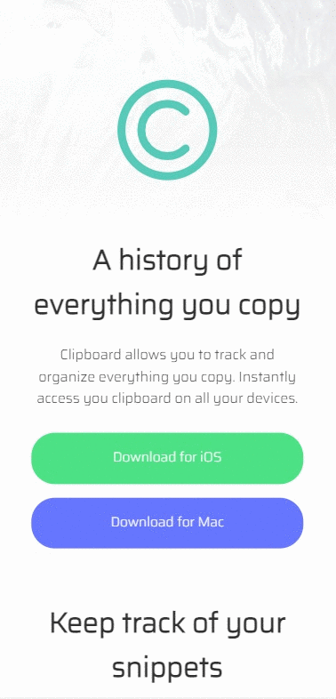

## Frontend Mentor-Clipboard landing page

❤️ This project is Code Challenge from Frontend Mentor (https://www.frontendmentor.io/challenges/clipboard-landing-page-5cc9bccd6c4c91111378ecb9). 
 
 
👨‍💻 The main aim of this project is to improve my <b>HTML/CSS skills and ©️cloning abilities</b>.
  
🎯 This challenge is to build out this landing page and get it looking as close to the design as possible..
  
🔗 To see live version 🎯
 

 ⌛ Happy Coding  ✍ 

  
🌐 The desktop and mobile versions of the web page are as follows;🧭
  

## 🖥️Desktop version
 

 
 
 
 
 
 
 
 
 
         

## 📱Mobile version
 

